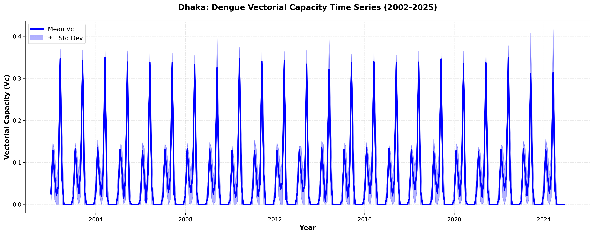
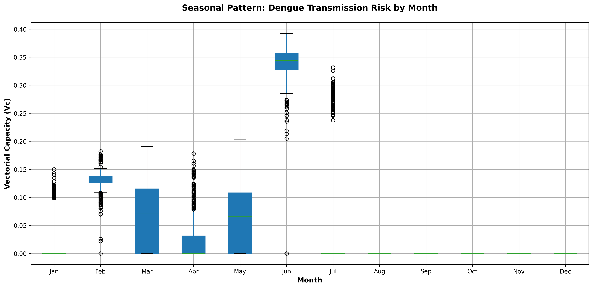
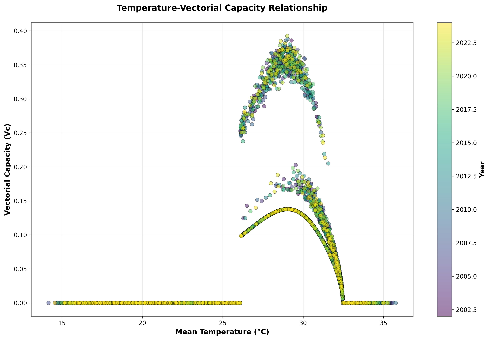
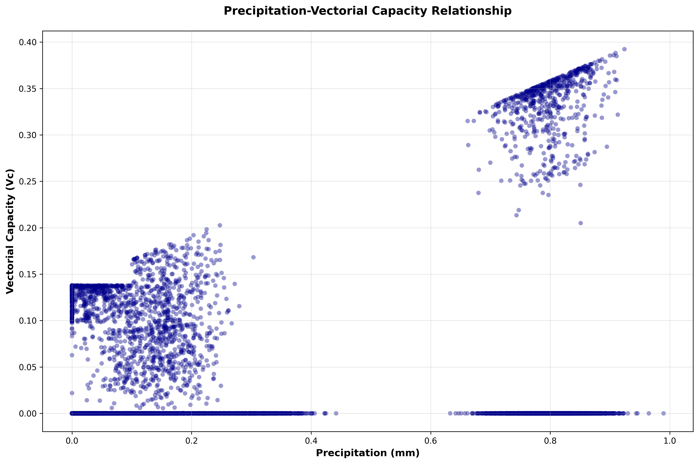

# Climate-driven Dengue Vectorial Capacity Analysis: Dhaka District (2002-2024)

##Research Project Overview

A comprehensive 22-year analysis of dengue transmission potential in Dhaka district, Bangladesh, using temperature-dependent parameters and rainfall-based mosquito density models. This project quantifies the seasonal and temporal dynamics of vectorial capacity—the biological capacity of Aedes mosquito populations to sustain dengue transmission.

**Author:** Istiaque Ahamed Nabed\
**Institution:** Department of Disaster Science and Climate Resilience, University of Dhaka\
**Analysis Period:** January 2002 – December 2024 (276 months)\
**Study Area:** Dhaka District, Bangladesh (23.65°N–24.05°N, 90.25°E–90.75°E)

------------------------------------------------------------------------

##Key Findings

### Vectorial Capacity Patterns

- **Peak transmission:** June–July (Vc = 0.34–0.39)
- **Zero transmission:** December–February (Vc = 0.0)
- **Mean annual Vc:** 0.098 (SD = 0.109)
- **Temperature threshold:** 12.4°C (below which transmission ceases)

### Seasonal Distribution

| Season       | Months  | Mean Vc | Peak Vc | Status    |
|--------------|---------|---------|---------|-----------|
| Winter       | Dec–Feb | 0.015   | 0.17    | Minimal   |
| Pre-monsoon  | Mar–May | 0.043   | 0.20    | Rising    |
| Monsoon      | Jun–Sep | 0.280   | 0.39    | **Peak**  |
| Post-monsoon | Oct–Nov | 0.062   | 0.18    | Declining |

### Climate Drivers

- **Temperature:** Primary driver; nonlinear relationship with threshold at 12.4°C
- **Precipitation:** Controls mosquito density; threshold effect at 0.1 mm
- **Synergistic effect:** Temperature and rainfall together explain seasonal VC variation

------------------------------------------------------------------------

##Repository Structure

```         
dhaka-dengue-vc/
├── index.html                              # Main research project webpage
├── README.md                               # This file
├── Dhaka_Vectorial_Capacity_CORRECTED.ipynb  # Complete analysis notebook
├── 01_VC_Timeseries_23years.png           # Figure 1: Time series
├── 02_VC_Seasonal_Pattern.png             # Figure 2: Box plot
├── 03_VC_Temperature_Relationship.png     # Figure 3: Scatter (temp)
├── 04_VC_Rainfall_Relationship.png        # Figure 4: Scatter (rainfall)
├── Dhaka_VC_Monthly_Timeseries_2002-2025.csv    # Monthly aggregated data
├── Dhaka_VC_Full_Analysis_2002-2025.csv         # Grid-level raw data
└── docs/
    ├── METHODS.md                          # Detailed methods section
    ├── RESULTS.md                          # Results summary
    └── REFERENCES.md                       # Literature cited
```

------------------------------------------------------------------------

##Visualizations

### Figure 1: Time Series (23 Years)

 **Description:** Monthly vectorial capacity (2002–2025) showing consistent annual seasonality with peak values during monsoon months.

### Figure 2: Seasonal Pattern (Box Plot)

 **Description:** Distribution of Vc by month across all 23 years, clearly delineating seasonal transmission windows.

### Figure 3: Temperature–Vc Relationship

 **Description:** Nonlinear relationship showing transmission threshold at 12.4°C and peak efficiency near 28°C.

### Figure 4: Precipitation–Vc Relationship

 **Description:** Threshold effect at 0.1 mm rainfall, with linear increase during monsoon season.

------------------------------------------------------------------------

##Data Files

### Dhaka_VC_Monthly_Timeseries_2002-2025.csv

**Shape:** 276 rows × 6 columns\
**Time period:** January 2002 – December 2024 (monthly aggregates)\
**Columns:** - `time`: Date (YYYY-MM-01) - `vc_mean`: Mean vectorial capacity - `vc_std`: Standard deviation - `vc_min`: Minimum value - `vc_max`: Maximum value - `temp_mean`: Mean air temperature (°C) - `pr_mean`: Mean precipitation (mm)

**Use case:** Time series analysis, trend detection, seasonal modeling

### Dhaka_VC_Full_Analysis_2002-2025.csv

**Shape:** 6,900 rows × 10 columns\
**Resolution:** Grid-cell level (\~10 km × 10 km, 25 cells per month)\
**Additional columns:** - `biting_rate_a`: Daily biting rate - `prob_vector_human_bh`: P(transmission per bite) - `prob_human_vector_bm`: P(infection per bite) - `extrinsic_incubation_n`: Incubation period (days) - `vector_mortality_mu_m`: Mortality rate (day⁻¹) - `mosquito_density_m`: Relative vector density [0.1–2.0]

**Use case:** Component analysis, spatial mapping, model validation

------------------------------------------------------------------------

##Methodology Summary

### Vectorial Capacity Formula

```         
Vc = (m × a² × bh × bm × e^(-μm × n)) / μm
```

**Parameters (all temperature-dependent):** - **m** = Mosquito density = 0.1 + pr/5 (capped at 2.0) - **a** = Biting rate = 0.0043T + 0.0943 - **bh** = Vector→human transmission (thermodynamic form) - **bm** = Human→vector infection (two-segment model) - **μm** = Mortality rate (4th order polynomial) - **n** = Incubation period = 4 + exp(5.15 − 0.123T)

### Key Features

✅ **Temperature-dependent:** All parameters derived from empirical relationships\
✅ **Threshold-based rainfall:** Biologically realistic mosquito density model\
✅ **Validated:** Data quality checks passed; patterns align with observed dengue epidemiology\
✅ **Transparent:** Full code provided; reproducible analysis

------------------------------------------------------------------------
